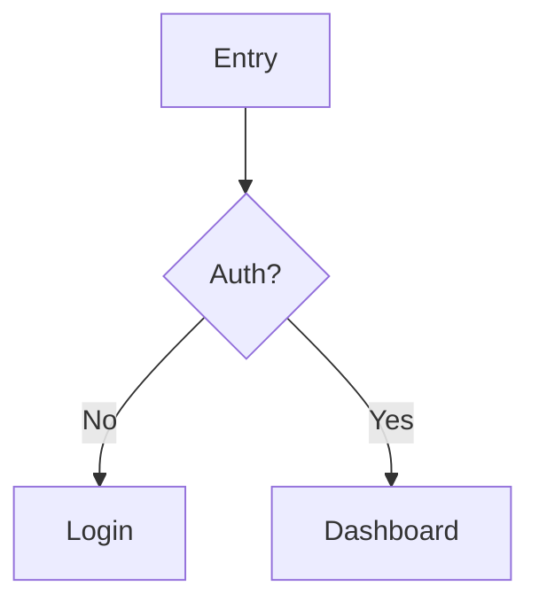

# UX for Web Apps

This skill helps you do high-quality UX work on web applications:

- **Evaluate** existing UX (heuristics + accessibility + flows)
- **Propose** concrete improvements (interaction + IA + content)
- **Produce** implementation-ready specs (states, rules, acceptance criteria, analytics)
- **Validate** with lightweight testing plans

## When to Use This Skill

Use this skill when the user asks for:

- UX review / audit / heuristic evaluation / usability critique
- Improve onboarding, forms, settings, dashboards, funnels
- Redesign a flow (signup, checkout, search, CRUD, etc.)
- Accessibility review (keyboard nav, focus, screen reader basics)
- Wireframes (textual), user flows, information architecture, microcopy
- "Write the spec" / "Define acceptance criteria" for UX changes

## Default Operating Mode

- Do **not** block on missing context. Make minimal assumptions, label them, and proceed.
- Ask at most **5** clarifying questions only if the answers would change recommendations materially.
- **Default to Quick UX Pass** (lightweight feedback). Only escalate to full audits/specs when explicitly requested or clearly warranted.
- Avoid "pixel" design. Provide **interaction rules + layout intent** and **component guidance**.
- **Capture your own screenshots** when browser tools are available (see Visual Inspection below).

## Visual Inspection

**Always attempt to see the actual UI before giving advice.** Code alone is insufficient for UX evaluation.

### When Browser Tools Are Available

If you have access to browser/chrome-tester MCP tools:

1. **Launch the app** in the browser tool
2. **Capture screenshots** of the relevant flows/pages
3. **Interact with the UI** to understand real behavior (hover states, focus, transitions)
4. **Test keyboard navigation** and tab order
5. **Check responsive behavior** at different viewport sizes

This is the preferred mode—your advice will be grounded in reality.

### When No Browser Tools Available

If you cannot capture screenshots yourself:

1. **Ask the user for screenshots** of the relevant screens/flows
2. **Request screen recordings** for complex interactions
3. **Clearly label** any advice as "based on code review only" with lower confidence
4. **Focus on structural issues** (missing states, error handling, accessibility attributes) rather than visual/layout advice

**Do not hallucinate visual details.** If you haven't seen it, say so.

## Design Context

Adapt your recommendations to the type of product:

| Context | Pattern Preference | Delight Level | Examples |
|---------|-------------------|---------------|----------|
| **B2B / SaaS / Internal Tools** | Conservative, conventional | Low | Admin dashboards, CRMs, dev tools |
| **Consumer Apps** | Balanced | Medium | Social apps, productivity, e-commerce |
| **Marketing / Landing Pages** | Creative, distinctive | High | Product launches, campaigns, portfolios |

Ask about context if unclear. Don't apply enterprise UX patterns to a playful consumer app, and don't suggest whimsical animations for an accounting dashboard.

## Decision Tree

**What did the user provide?**

| Input | Action |
|-------|--------|
| Screenshots / URL / flow description | **Quick UX Pass** (default) or full audit if requested |
| Feature idea / problem statement only | Propose the flow + lightweight spec |
| Access to codebase | Capture screenshots first (if browser tools available), then Quick UX Pass |
| Browser tools available | **Use them.** Launch app, capture screenshots, then evaluate |

## Output Formats

**Default: Quick UX Pass.** Only escalate when explicitly requested or when the scope clearly warrants it.

| Format | When to Use | Output |
|--------|-------------|--------|
| **Quick UX Pass** (default) | "Review this", "Is this good?", "Quick feedback" | Top 5-10 issues with severity, rationale, and fixes |
| **UX Audit** | "Full audit", "Comprehensive review", complex multi-screen flows | Flow map + issue backlog + prioritized roadmap (use `templates/UX_AUDIT.md`) |
| **Design Spec** | "Write the spec", "Acceptance criteria", new feature design | Interaction rules, states, copy, criteria, analytics (use `templates/DESIGN_SPEC.md`) |
| **Validation Plan** | "Test plan", "How do we validate this?" | Usability test script + tasks + success criteria (use `templates/USABILITY_TEST.md`) |

**Escalation signals**: User says "thorough", "comprehensive", "full", "deep dive", or the task involves 5+ screens/states.

## Reference Materials

- Heuristics + severity scale: `reference/HEURISTICS.md`
- Checklists (forms, nav, a11y, responsive): `reference/CHECKLISTS.md`

---

# Workflow

## Step 0: Minimal Intake

If not provided, ask up to 5 questions:

1. Primary user + primary job-to-be-done
2. The "money path" (or core success metric)
3. Target devices (desktop-first? mobile-heavy?)
4. Known pain points (support tickets, drop-offs, complaints)
5. Constraints: design system? brand? engineering constraints?

Then proceed even if unanswered.

## Step 1: Inventory

Goal: list key surfaces + states.

- Primary pages/routes
- Key flows (happy path + critical edge cases)
- Reusable components (forms, modals, tables, nav, toasts)
- States: loading/empty/error/permission-denied/offline

If you have codebase access:
- Read README + runbook
- Identify routing and main layouts
- Locate component library/design tokens
- Locate API error handling and auth boundaries (401/403)

## Step 2: Task-First Flow Mapping

Create a flow map with:

- Steps
- User intent per step
- System feedback per step
- Failure modes per step
- Where users need to decide vs. just execute

Deliver as a **Mermaid diagram** (sequence or flowchart) whenever possible to expose logic gaps.

If text is necessary, use strict indentation.

## Step 3: Evaluate

Use three lenses:

### Heuristics (Nielsen)
Apply the 10 heuristics with severity scoring (see `reference/HEURISTICS.md`)

### Accessibility
- Keyboard: tab order, focus visibility, no traps
- Labels: form fields have labels, icons have accessible names
- Contrast: sufficient color contrast, non-color cues for status
- Targets: reasonable touch/click target sizes
- Motion: avoid essential meaning conveyed only via animation

### Content Quality
- Clarity, brevity, consistency
- Terminology matches user mental model
- Tone appropriate for context

### The Startup Lens (YC/PG)
- **Time to Value**: How fast is the "Aha!"?
- **Simplicity**: Is it "Radically Simple" or just decorated?
- **Obviousness**: Does it pass the "Mom Test"?

## Step 4: Synthesize and Prioritize

For each issue, specify:

- **Principle-Based Rationale**: You MUST cite a Law or Heuristic (e.g., "Violates Hick's Law," "Fails YC Obviousness Test"). Do not use "vibes."

- **Impact**: drop-off, errors, support load, trust
- **Effort/risk**: engineering + design complexity
- **Priority**: Impact x Confidence / Effort

## Step 5: Propose Fixes as Rules, Not Vibes

For each fix, specify:

- **Interaction rules**: what happens on click/submit/back/escape
- **States**: loading/success/error/empty/disabled
- **Copy**: microcopy and error messages (specific rewrites)
- **Layout intent**: information hierarchy, grouping, spacing intent
- **Component guidance**: reuse existing components; avoid one-offs
- **Analytics hooks**: events and properties to track

## Step 6: Spec + Acceptance Criteria

Write acceptance criteria that are testable:

- Given/When/Then format
- Include edge cases (timeouts, 401/403, validation, retries)
- Include accessibility requirements (keyboard + focus + labels)
- Include analytics requirements (event names + properties)

## Step 7: Validation Plan

If changes are meaningful:

- 5-user usability test (30 min each) with 3-6 tasks
- Define success: task success rate, time-on-task, critical errors, self-reported confidence

---

# Issue Reporting Format

For audits, output issues in this format:

| ID | Location | Problem | Evidence | Heuristic | Sev | Recommendation | Acceptance Criteria |
|----|----------|---------|----------|-----------|-----|----------------|---------------------|
| 1  | Login    | Submit button disabled with no explanation | Users click repeatedly | H5 / Doherty Threshold | 3 | Show helper text | Given incomplete form, When user views submit, Then helper text shows "Enter email and password" |

**Severity Scale (0-4):**
- 0: Not a problem / nit
- 1: Cosmetic; doesn't impede task completion
- 2: Minor; causes friction or mild error risk
- 3: Major; frequently blocks tasks or causes serious mistakes
- 4: Critical; prevents task completion, causes data loss, or creates severe trust/safety issues

---

# Web App Specific Considerations

Apply when relevant:

- **Auth boundaries**: 401 vs 403 vs 404 vs "no access" should be user-comprehensible
- **API latency**: always provide feedback; avoid "dead UI"; use skeletons/spinners intentionally
- **Optimistic UI**: only when rollback is safe and understandable
- **Forms**: inline validation, preserve inputs on error, focus management on submit errors
- **Deep links**: URL should represent state when it matters (filters, selected tabs, entities)
- **Errors**: human-readable messages; include retry; log correlation ID where appropriate

---

# Example Triggering Requests

- "Can you UX-audit our signup flow?"
- "Rewrite this settings page to be less confusing."
- "Design the flow for creating a project and inviting teammates."
- "Our users keep failing at importing CSVs—fix the UX."
- "Make this dashboard accessible and keyboard-friendly."

---

# Deliverable Checklist

When responding, always deliver:

1. A prioritized list of issues/fixes OR a proposed flow/spec
2. Concrete acceptance criteria
3. Any assumptions you made (labeled clearly)
