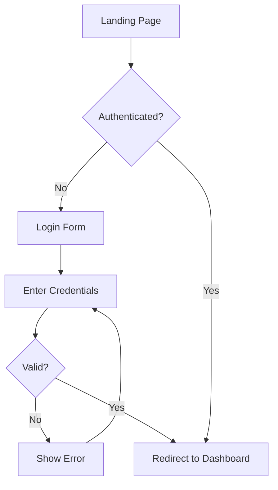

# Example: Login Form UX Audit

_This example demonstrates the expected quality and depth of a UX audit output._

## Context

| Field | Value |
|-------|-------|
| Product | SaaS Dashboard (B2B) |
| Primary users | Business users accessing internal tools |
| Primary job-to-be-done | Authenticate quickly to access dashboard |
| Success metric | Login success rate, time to login |
| Platforms | Desktop-first, mobile secondary |
| Constraints | Must work with SSO, existing design system |

## Assumptions

1. Users have existing accounts (not signup flow)
2. SSO is available but not required
3. Password reset flow exists but is out of scope

---

## Flow Map (Critical Path)

---

## Findings Summary

### Top 3 Themes

1. **Poor Error Feedback**: Generic error messages don't help users recover
2. **Missing Loading States**: No feedback during authentication
3. **Accessibility Gaps**: Focus management and keyboard nav issues

---

## Issue Backlog (Prioritized)

| ID | Location | Problem | Evidence | Principle | Sev | Impact | Confidence | Effort | Priority | Recommendation | Acceptance Criteria |
|----|----------|---------|----------|-----------|-----|--------|------------|--------|----------|----------------|---------------------|
| 1 | Login form | Submit button shows no loading state during auth | Users click repeatedly, causing multiple requests | H1 / L4 | 3 | 4 | 4 | 2 | 8.0 | Add spinner and disable button during submit | Given credentials submitted, When auth is processing, Then button shows spinner and is disabled |
| 2 | Error message | "Invalid credentials" doesn't specify email vs password | 60% of support tickets are password-related | H9 | 3 | 4 | 3 | 2 | 6.0 | Show "Email not found" vs "Incorrect password" separately | Given wrong password, When form submitted, Then error says "Incorrect password" with reset link |
| 3 | Password field | No show/hide password toggle | Users with complex passwords mistype frequently | H3 / H7 | 2 | 3 | 3 | 2 | 4.5 | Add eye icon toggle to reveal password | Given password field, When user clicks eye icon, Then password text is visible |
| 4 | Form | Tab order skips "Forgot password" link | Keyboard users cannot access reset flow | WCAG 2.4.3 | 3 | 3 | 3 | 3 | 3.0 | Include link in tab order after password field | Given keyboard navigation, When user tabs through form, Then focus order is: email, password, forgot link, submit |
| 5 | Submit button | Button is disabled with no explanation when form incomplete | Users don't know why they can't submit | H1 / H5 | 2 | 2 | 3 | 3 | 2.0 | Show helper text OR keep button enabled and validate on click | Given incomplete form, When user views submit, Then helper text shows "Enter email and password" |
| 6 | SSO section | "Sign in with SSO" is below the fold on mobile | Mobile users don't discover SSO option | H6 / L2 | 2 | 2 | 2 | 3 | 1.3 | Move SSO above email/password form or make equally prominent | Given mobile viewport, When login page loads, Then SSO option is visible without scrolling |

**Severity Scale:** 0=Not a problem, 1=Cosmetic, 2=Minor, 3=Major, 4=Critical  
**Scoring Scale (Impact/Confidence/Effort):** 1=Low, 3=Medium, 5=High

---

## Quick Wins (Low effort, high impact)

_Changes that can ship in 1-3 days:_

1. **Add loading spinner to submit button** (Issue #1) - Prevents double-submit, shows progress
2. **Add show/hide password toggle** (Issue #3) - Standard pattern, reduces typos
3. **Fix tab order for forgot password link** (Issue #4) - CSS/HTML fix only

---

## Larger Improvements (Higher effort)

1. **Differentiate error messages by type** (Issue #2)
   - Effort: Medium (requires backend change to return error type)
   - Impact: High (reduces support tickets significantly)
   - Dependencies: API team agreement on error response format

2. **Redesign SSO prominence** (Issue #6)
   - Effort: Medium (design + responsive testing)
   - Impact: Medium (depends on SSO adoption rate)
   - Dependencies: Analytics data on current SSO usage

---

## Validation Plan

### Biggest Uncertainty
_Whether differentiated error messages will actually reduce support load or just shift questions._

### Proposed Validation
- [ ] Method: A/B test with 50% rollout
- [ ] Participants: All login attempts over 2 weeks
- [ ] Success looks like: 20% reduction in password-related support tickets

---

## Accessibility Notes

| Issue | WCAG Criterion | Impact | Fix |
|-------|----------------|--------|-----|
| Forgot password link not in tab order | 2.4.3 Focus Order | Keyboard users cannot reset password | Add to natural tab sequence |
| No visible focus indicator on SSO button | 2.4.7 Focus Visible | Keyboard users lose track of position | Add visible focus ring matching design system |
| Error messages not announced to screen readers | 4.1.3 Status Messages | Screen reader users miss errors | Add `aria-live="polite"` to error container |

---

## Next Steps

1. [x] Prioritize issues with product team
2. [ ] Implement quick wins (Issues 1, 3, 4) in current sprint
3. [ ] Create design spec for improved error handling (Issue 2)
4. [ ] Run 5-user usability test on updated flow
