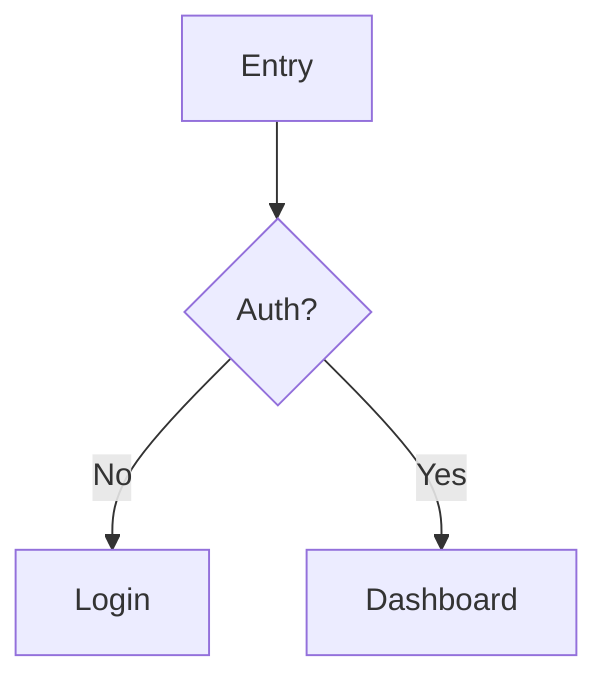

# UX Workflow

Detailed step-by-step workflow for UX audits and design specs.

---

## Step 0: Minimal Intake

If not provided, ask up to 5 questions:

1. Primary user + primary job-to-be-done
2. The "money path" (or core success metric)
3. Target devices (desktop-first? mobile-heavy?)
4. Known pain points (support tickets, drop-offs, complaints)
5. Constraints: design system? brand? engineering constraints?

Then proceed even if unanswered.

---

## Step 1: Inventory

Goal: list key surfaces + states.

- Primary pages/routes
- Key flows (happy path + critical edge cases)
- Reusable components (forms, modals, tables, nav, toasts)
- States: loading/empty/error/permission-denied/offline

If you have codebase access:
- Read README + runbook
- Identify routing and main layouts
- Locate component library/design tokens
- Locate API error handling and auth boundaries (401/403)

---

## Step 2: Task-First Flow Mapping

Create a flow map with:

- Steps
- User intent per step
- System feedback per step
- Failure modes per step
- Where users need to decide vs. just execute

Deliver as a **Mermaid diagram** (sequence or flowchart) whenever possible to expose logic gaps.

If text is necessary, use strict indentation.

---

## Step 3: Evaluate

Use three lenses:

### Heuristics (Nielsen)

Apply the 10 heuristics with severity scoring (see `HEURISTICS.md`).

### Accessibility

- Keyboard: tab order, focus visibility, no traps
- Labels: form fields have labels, icons have accessible names
- Contrast: sufficient color contrast, non-color cues for status
- Targets: reasonable touch/click target sizes
- Motion: avoid essential meaning conveyed only via animation

### Content Quality

- Clarity, brevity, consistency
- Terminology matches user mental model
- Tone appropriate for context

### The Startup Lens (YC/PG)

- **Time to Value**: How fast is the "Aha!"?
- **Simplicity**: Is it "Radically Simple" or just decorated?
- **Obviousness**: Does it pass the "Mom Test"?

---

## Step 4: Synthesize and Prioritize

For each issue, specify:

- **Principle-Based Rationale**: You MUST cite a Law or Heuristic (e.g., "Violates Hick's Law," "Fails YC Obviousness Test"). Do not use "vibes."
- **Impact**: drop-off, errors, support load, trust
- **Effort/risk**: engineering + design complexity
- **Priority**: Impact x Confidence / Effort

---

## Step 5: Propose Fixes as Rules, Not Vibes

For each fix, specify:

- **Interaction rules**: what happens on click/submit/back/escape
- **States**: loading/success/error/empty/disabled
- **Copy**: microcopy and error messages (specific rewrites)
- **Layout intent**: information hierarchy, grouping, spacing intent
- **Component guidance**: reuse existing components; avoid one-offs
- **Analytics hooks**: events and properties to track

---

## Step 6: Spec + Acceptance Criteria

Write acceptance criteria that are testable:

- Given/When/Then format
- Include edge cases (timeouts, 401/403, validation, retries)
- Include accessibility requirements (keyboard + focus + labels)
- Include analytics requirements (event names + properties)

---

## Step 7: Validation Plan

If changes are meaningful:

- 5-user usability test (30 min each) with 3-6 tasks
- Define success: task success rate, time-on-task, critical errors, self-reported confidence
